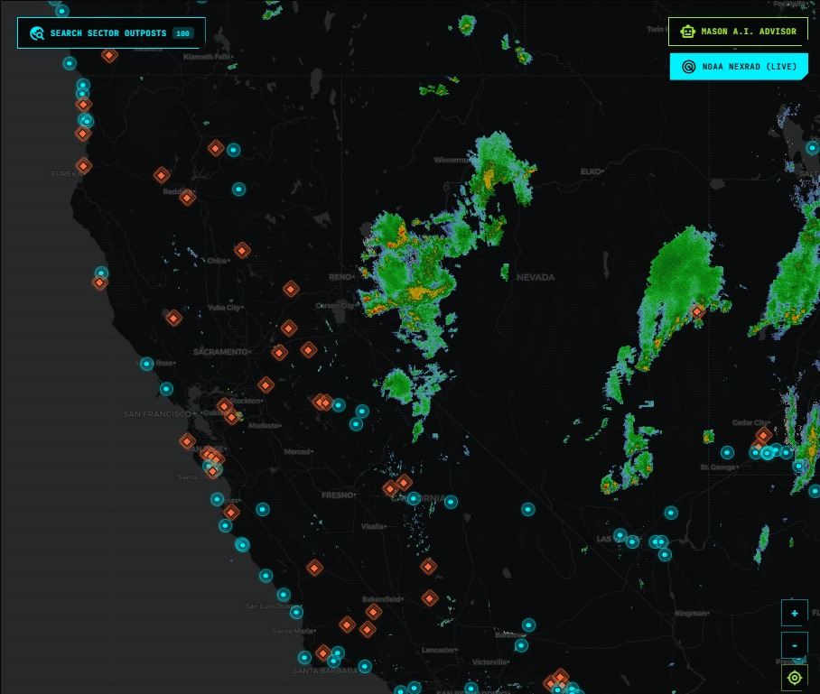
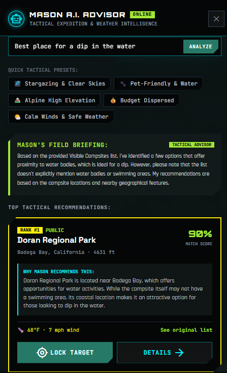
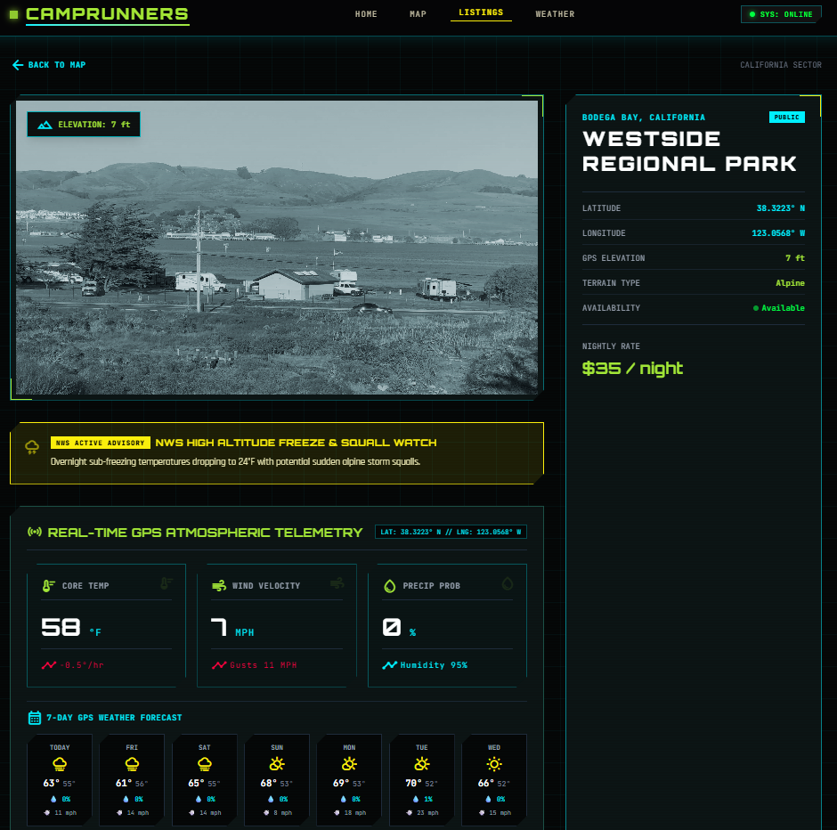

# 🌲 CAMPRUNNERS // Tactical Outdoor Intelligence & Campsite Explorer

<div align="center">

```
  ____   _   __  __  ____   ____   _   _  _   _  _   _  _____  ____   ____  
 / ___| / \ |  \/  ||  _ \ |  _ \ | | | || \ | || \ | || ____||  _ \ / ___| 
| |    / _ \| |\/| || |_) || |_) || | | ||  \| ||  \| ||  _|  | |_) |\___ \ 
| |___/ ___ \ |  | ||  __/ |  _ < | |_| || |\  || |\  || |___ |  _ <  ___) |
 \____/_/   \_\_|  |_||_|    |_| \_\ \___/ |_| \_||_| \_||_____||_| \_\|____/ 
```

**Tactical Outdoor Expedition Platform · Real-Time GPS Telemetry · Autonomous A.I. Advisor**

[](https://www.typescriptlang.org/)
[](https://reactjs.org/)
[](https://vitejs.dev/)
[](https://leafletjs.com/)
[](https://groq.com/)
[](https://www.noaa.gov/)

</div>

---

## 📸 Interface Showcase & Feature Demos

<div align="center">

### 🗺️ Live NOAA NEXRAD Doppler Weather Radar & Map Explorer
*Interactive Leaflet dark HUD canvas streaming real-time precipitation radar overlays and tactical pulse beacons.*



</div>

<br />

<div align="center">

### 🤖 Mason A.I. Advisor & 🛰️ GPS Atmospheric Telemetry

<table>
  <tr>
    <td width="42%" valign="top">
      <h4 align="center">🤖 Mason A.I. Advisor HUD</h4>
      
      <p align="center"><sub>Autonomous conversational advisor providing tactical rankings, match scores, and direct Leaflet map tool controls.</sub></p>
    </td>
    <td width="58%" valign="top">
      <h4 align="center">🛰️ Real-Time Telemetry & NWS Hazard Feeds</h4>
      
      <p align="center"><sub>Live Open-Meteo GPS weather metrics, USGS DEM elevations, 7-day microclimate forecasts, and NWS active freeze & squall warnings.</sub></p>
    </td>
  </tr>
</table>

</div>

---

## 📜 Origin & Backstory

> *"Great ideas shouldn't be left behind in a classroom repository."*

**Camprunners** originally started as a **Senior Capstone project** at university, conceptualized by **Daniel Palomera** and his close friend **Mason**. The vision was bold: replace clumsy, ad-cluttered camping directories with a streamlined, cyber-tactical interface built for modern outdoor explorers, overlanders, and dispersed campers.

When academic priorities shifted and the capstone team was reassigned to a different corporate project, the original codebase was set aside. But Daniel couldn't shake the potential of what they had imagined. 

Taking the concept into his own hands, Daniel built **Camprunners** from the ground up—re-architecting the entire platform into a high-performance web application, connecting real-time satellite atmospheric data, USGS elevation models, and NOAA Doppler radar. To honor his friend who sparked the original vision, Daniel built and named the platform’s intelligent expedition advisor **Mason**.

---

## ⚡ Key Capabilities & Architecture

### 🧭 1. Interactive Map Explorer
- **High-Precision Leaflet Engine**: Real-time bounding box queries that fetch and render authentic campgrounds dynamically as you pan and zoom.
- **Viewport State Persistence**: Seamlessly preserves your exact coordinate position and zoom level when navigating between campsite details and the map.
- **NOAA / IEM NEXRAD Base Reflectivity Radar**: Live Doppler precipitation weather radar overlay that functions smoothly across all zoom levels (0–19+).
- **Default Yosemite Sector**: Automatically initializes centered over Yosemite National Park, California (`37.7456° N, 119.5936° W`).

### ⛺ 2. Dual Provider Aggregation (Public & Private)
- **Public Wilderness & State/National Parks**: Curated public lands, BLM sectors, and national forest campgrounds.
- **Hipcamp Private Land Integrations**: GraphQL integration with authentic camper descriptions, verified host amenities, and Cloudinary media delivery.
- **Provider Filtering**: Instant toggle between `ALL SOURCES`, `PUBLIC`, and `HIPCAMP` with dedicated neon HUD pin geometries (Cyan Circles vs. Orange Diamonds).

### 🤖 3. Mason A.I. Advisor (Autonomous Tool-Calling)
- **Groq Cloud Llama 3.3 70B Engine**: Ultra-fast server-side reasoning analyzing visible outposts against real-time microclimate vectors and DEM terrain data.
- **Autonomous Map Tool Calling**:
  - **Destination Fly-To**: Mentioning regions like *"Yosemite"*, *"Lake Tahoe"*, or *"Joshua Tree"* automatically flies the map camera to those coordinates.
  - **Weather Radar Auto-Engagement**: Asking about rain, storms, or squalls automatically toggles the live NOAA NEXRAD precipitation radar.
  - **AI Target Reticle Beacons**: Renders spinning, glowing AI Target Reticles `[ 🎯 MASON AI PICK ]` on top recommended outposts on the map canvas.
  - **One-Click Target Lock**: Instantly swoops the camera into the chosen campsite at zoom level 13.
- **Zero-Latency Fallback Engine**: Multi-dimensional tactical NLP heuristic engine ensures Mason functions reliably even without an active internet connection.

### 🛰️ 4. Real-Time Atmospheric Telemetry & Hazard Feeds
- **Open-Meteo GPS Microclimate Data**: Live core temperature, wind speeds, wind gusts, precipitation probability, humidity, and atmospheric pressure.
- **7-Day Daily Forecast Hub**: High/low temperatures, microclimate condition trends, and rain probability forecasts for every GPS coordinate.
- **USGS / Copernicus DEM Elevation**: 100% authentic GPS elevation calculations accurate to within meters.
- **National Weather Service (NWS) Active Alerts**: Live warnings for freeze watches, high wind advisories, and sudden squall conditions.

---

## 🛠️ Technology Stack

| Layer | Technology |
|---|---|
| **Frontend Framework** | React 18 (TypeScript) |
| **Build & Dev Server** | Vite 6.0 |
| **Styling & HUD Design** | Tailwind CSS + Custom Cyber-Tactical Design System |
| **Mapping Engine** | Leaflet.js with Carto Dark HUD & NOAA NEXRAD Tile Overlays |
| **A.I. Model** | Groq Cloud (`llama-3.3-70b-versatile`) |
| **Atmospheric Telemetry** | Open-Meteo API & National Weather Service (NWS) API |
| **Topographic DEM** | USGS / Copernicus Digital Elevation API |
| **Provider APIs** | Dyrt v10 API Scraper & Hipcamp GraphQL Resolver |

---

## 🚀 Getting Started

### Prerequisites
- [Node.js](https://nodejs.org/) (v18 or higher recommended)
- [npm](https://www.npmjs.com/) or [pnpm](https://pnpm.io/)

### Installation

1. **Clone the repository**:
   ```bash
   git clone https://github.com/Danielwoot/camprunners.git
   cd camprunners
   ```

2. **Install dependencies**:
   ```bash
   npm install
   ```

3. **Configure Environment Variables**:
   Create a `.env` file in the root directory:
   ```env
   # Groq Cloud API Key (Free at https://console.groq.com/keys)
   GROQ_API_KEY=your_groq_api_key_here
   ```

4. **Start the local development server**:
   ```bash
   npm run dev
   ```
   Open `http://localhost:3000` in your browser.

5. **Build for Production**:
   ```bash
   npm run build
   ```

---

## 🔒 Security & Privacy

- All AI requests run through the backend proxy route (`/api/ai/mason-advisor`).
- The `GROQ_API_KEY` is strictly held on the server side and is **never exposed to client browser bundles or network inspectors**.
- `.env` and `.env.local` files are strictly included in `.gitignore`.

---

## 👨‍💻 Author & Acknowledgments

- **Creator & Lead Developer**: [Daniel Palomera](https://github.com/Danielwoot)
- **Conceptual Inspiration**: Mason (Original Senior Capstone Co-Designer)
- **Data Providers**: Open-Meteo, NOAA / IEM, USGS, The Dyrt, Hipcamp

---

<div align="center">
  <sub>Built with passion for wilderness explorers and overlanders. © 2026 Daniel Palomera.</sub>
</div>
